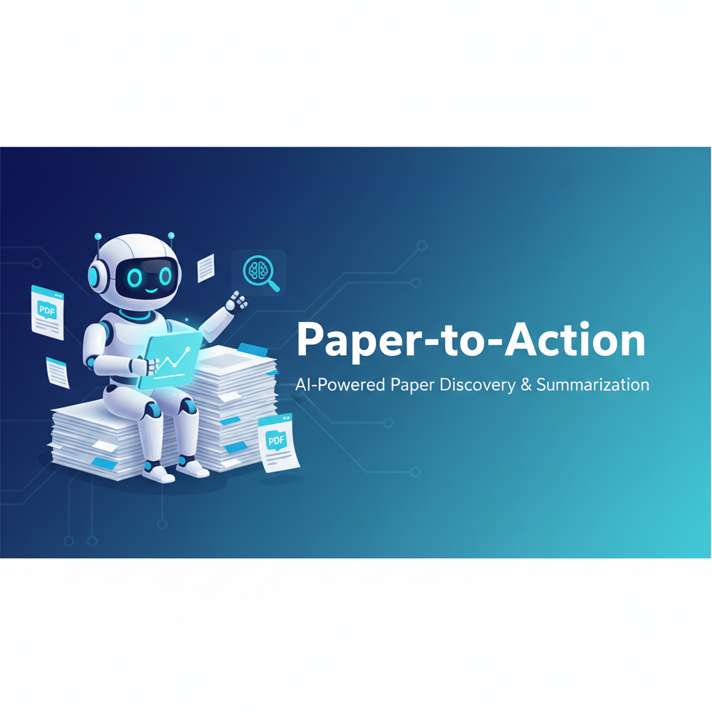
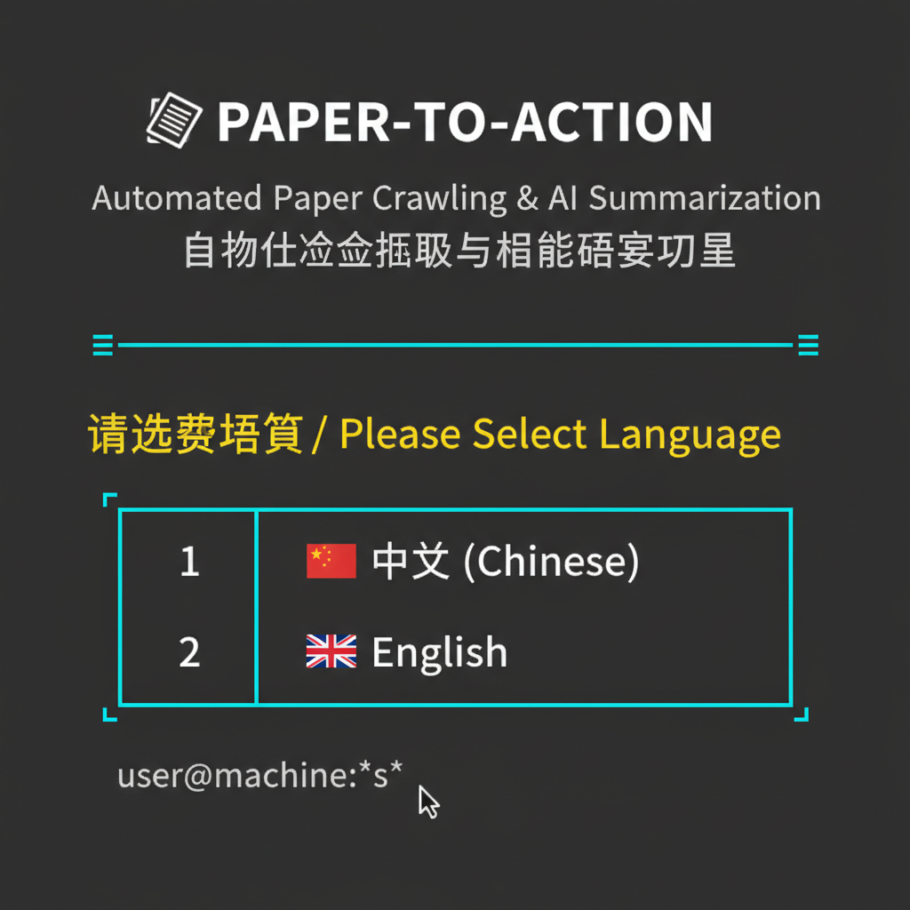
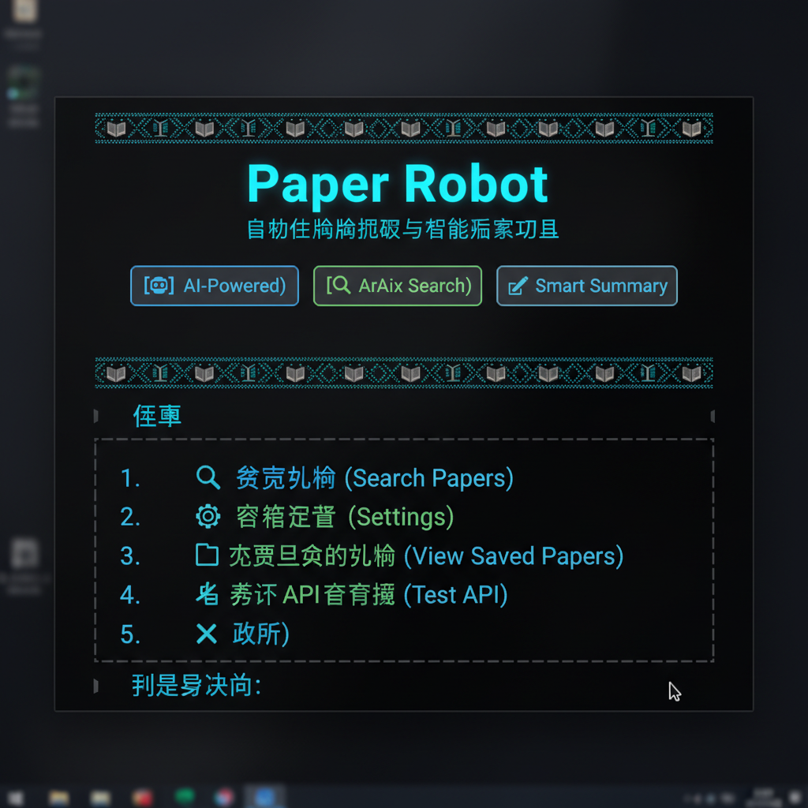

# Paper-to-Action

<div align="center">



[](https://opensource.org/licenses/MIT)
[](https://www.python.org/downloads/)
[](https://github.com/East-Hu/paper-to-action)
[](https://github.com/East-Hu/paper-to-action/pulls)

**全自动论文速递机器人 | 让学术研究更高效**

[English](README_EN.md) | 简体中文

</div>

---

## ✨ 特性亮点

- 🔍 **智能搜索** - 自动从 ArXiv 爬取最新论文，支持关键词、时间范围筛选
- 🤖 **AI 摘要** - 使用 LLM (GPT-4o-mini等) 生成中英文核心创新点总结
- 🎨 **精美 CLI** - 炫酷的命令行界面，支持中英文切换，丰富的动画效果
- 💻 **VSCode 插件** - 无缝集成到编辑器，边写代码边看论文
- 🚀 **一键部署** - Fork 即用，简单配置即可开始使用
- ⚙️ **高度可配置** - 自定义机器人名称、关键词、时间范围、输出格式等
- 🌍 **多语言支持** - 完整的中英文界面支持

## 📸 界面预览

<div align="center">

### 语言选择界面


### 主界面


### 论文搜索


</div>

## 🚀 快速开始

### 1. 安装

#### 方法一：从源码安装（推荐）

```bash
# 克隆仓库
git clone https://github.com/East-Hu/paper-to-action.git
cd paper-to-action

# 创建虚拟环境
python3 -m venv venv
source venv/bin/activate  # Windows: venv\\Scripts\\activate

# 安装依赖
pip install -e .
```

#### 方法二：使用 pip 安装（即将支持）

```bash
pip install paper-to-action
```

### 2. 配置 API

首次启动时会引导您配置 LLM API。您需要准备：

- **API Key**: 您的 LLM 服务提供商 API 密钥
- **Base URL**: API 基础 URL（默认为 OpenAI）
- **Model**: 使用的模型名称（推荐 gpt-4o-mini）

#### 支持的 LLM 提供商

- OpenAI (GPT-4, GPT-4o-mini 等)
- Azure OpenAI
- 任何兼容 OpenAI API 的服务 (如 vveai.com, deepseek 等)

### 3. 启动使用

```bash
# 启动交互式界面
paper-robot

# 或使用简写
pr
```

#### 首次运行流程

1. **选择语言** - 中文 或 English
2. **配置 API** - 输入您的 API 凭据
3. **开始搜索** - 输入关键词，自动爬取论文
4. **AI 总结** - 可选择生成 AI 摘要
5. **保存结果** - 自动保存为 Markdown 或 JSON

## 📖 使用指南

### 交互式模式（推荐）

```bash
paper-robot
```

启动后您将看到精美的欢迎界面，提供以下功能：

1. 🔍 **搜索论文** - 输入关键词搜索最新论文
2. ⚙️ **配置设置** - 管理 API、机器人名称、语言等
3. 📂 **查看历史** - 浏览已保存的论文
4. 🧪 **测试 API** - 验证 API 连接是否正常
5. ❌ **退出程序**

### 命令行模式

适合脚本化和自动化场景：

```bash
# 基础搜索
paper-robot search "AI Security"

# 指定时间范围
paper-robot search "RAG" --start-date 2025-01-01 --end-date 2025-01-19

# 指定结果数量
paper-robot search "Machine Learning" --max-results 50

# 不生成 AI 摘要
paper-robot search "NLP" --no-summarize

# 指定输出格式
paper-robot search "Computer Vision" --format markdown

# 查看配置
paper-robot config show

# 设置机器人名称
paper-robot rename "Mark's Auto Paper Robot"

# 测试 API 连接
paper-robot test
```

### 自定义机器人名称

让您的论文机器人更有个性：

```bash
paper-robot rename "东哥的学术助手"
```

之后欢迎界面将显示您自定义的名称！

## 💡 输出示例

论文会保存为精美的 Markdown 文件：

```markdown
# 论文速递 - 2025-01-19

**共找到 10 篇论文**

---

## 1. Advanced Techniques in AI Security

**作者：** John Doe, Jane Smith et al.
**发布日期：** 2025-01-15
**ArXiv ID：** 2501.12345
**PDF 链接：** [https://arxiv.org/pdf/2501.12345](https://arxiv.org/pdf/2501.12345)
**分类：** cs.AI, cs.CR

### 🤖 AI 核心创新点总结

本文提出了一种新的 AI 安全防护框架，主要创新点包括：
1. 基于对抗训练的鲁棒性增强方法
2. 实时威胁检测与响应机制
3. 在多个基准测试上达到 SOTA 性能

### 📄 原始摘要

We propose a novel framework for AI security...
```

## 🎨 VSCode 插件

### 安装插件

**方法一：从市场安装（即将上线）**
1. 在 VSCode 中按 `Ctrl+Shift+X` 打开扩展市场
2. 搜索 "Paper-to-Action"
3. 点击安装

**方法二：从源码安装**

```bash
cd vscode-extension
npm install
npm run compile
# 按 F5 启动调试
```

### 使用插件

1. 点击侧边栏的 📚 图标
2. 首次使用会提示配置 API
3. 输入搜索关键词、日期范围
4. 点击"搜索论文"按钮
5. 查看 AI 生成的摘要

## 🔧 高级用法

### GitHub Actions 自动化

实现每日自动推送最新论文到仓库！

创建 `.github/workflows/daily-papers.yml`：

```yaml
name: Daily Papers

on:
  schedule:
    - cron: '0 9 * * *'  # 每天 9:00 UTC
  workflow_dispatch:

jobs:
  fetch-papers:
    runs-on: ubuntu-latest
    steps:
      - uses: actions/checkout@v3
      - uses: actions/setup-python@v4
        with:
          python-version: '3.9'
      
      - name: Install dependencies
        run: pip install paper-to-action
      
      - name: Configure API
        run: |
          paper-robot config set --key api_key --value ${{ secrets.API_KEY }}
          paper-robot config set --key base_url --value ${{ secrets.BASE_URL }}
      
      - name: Search papers
        run: paper-robot search "AI Security" --format markdown
      
      - name: Commit results
        run: |
          git config --local user.email "action@github.com"
          git config --local user.name "GitHub Action"
          git add papers/
          git commit -m "Daily paper update $(date +'%Y-%m-%d')" || exit 0
          git push
```

**配置步骤：**
1. 在 GitHub 仓库设置中添加 Secrets
   - `API_KEY`: 您的 LLM API 密钥
   - `BASE_URL`: 您的 API Base URL
2. 提交工作流文件到仓库
3. 每天自动运行，论文推送到 `papers/` 目录

### Python API

直接在代码中使用：

```python
from paper_to_action import ArxivCrawler, LLMClient, PaperStorage

# 初始化
crawler = ArxivCrawler(max_results=20)
llm_client = LLMClient(api_key="your-key", base_url="your-url")
storage = PaperStorage(output_dir="papers")

# 搜索论文
papers = crawler.search_papers(
    keywords="AI Security",
    start_date="2025-01-01",
    end_date="2025-01-19"
)

# 生成摘要
papers = llm_client.batch_summarize(papers, language="zh")

# 保存结果
storage.save_papers_markdown(papers)
```

## ⚙️ 配置文件

配置文件位置：`~/.paper_robot/config.yaml`

```yaml
robot_name: "Paper Robot"     # 机器人名称
api_key: "your-api-key"       # API 密钥
base_url: "https://api.openai.com/v1"  # API 地址
model: "gpt-4o-mini"          # 使用的模型
max_results: 20               # 默认最大结果数
language: "zh"                # 界面语言 (zh/en)
output_dir: "papers"          # 输出目录
```

## 🤝 贡献

欢迎贡献！请查看 [贡献指南](CONTRIBUTING.md)

1. Fork 本仓库
2. 创建您的特性分支 (`git checkout -b feature/AmazingFeature`)
3. 提交您的更改 (`git commit -m 'Add some AmazingFeature'`)
4. 推送到分支 (`git push origin feature/AmazingFeature`)
5. 打开 Pull Request

## 📄 许可证

本项目采用 MIT 许可证 - 查看 [LICENSE](LICENSE) 文件了解详情

## 🙏 致谢

- [ArXiv](https://arxiv.org/) - 优质的学术论文预印本平台
- [Rich](https://github.com/Textualize/rich) - 精美的终端输出库
- [Typer](https://github.com/tiangolo/typer) - 现代化的 CLI 框架

## 📧 联系方式

- GitHub: [@East-Hu](https://github.com/East-Hu)
- 项目链接: [https://github.com/East-Hu/paper-to-action](https://github.com/East-Hu/paper-to-action)

## ⭐ Star History

如果这个项目对您有帮助，请给个 Star！

---

<div align="center">

**Made with ❤️ for researchers worldwide**

</div>
